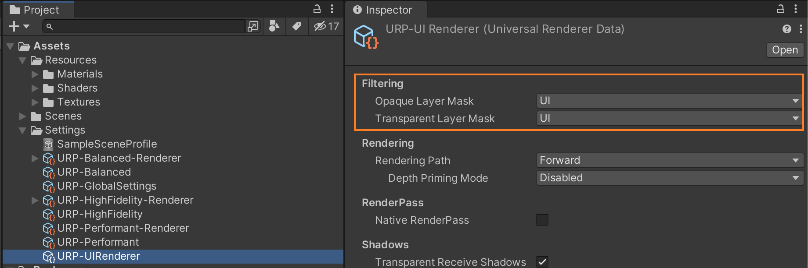
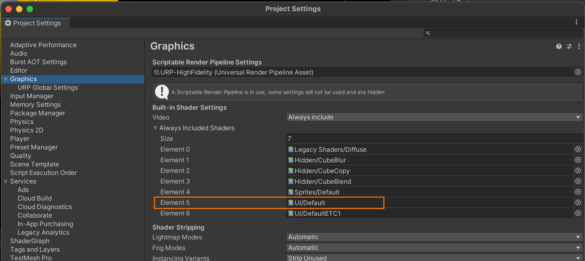
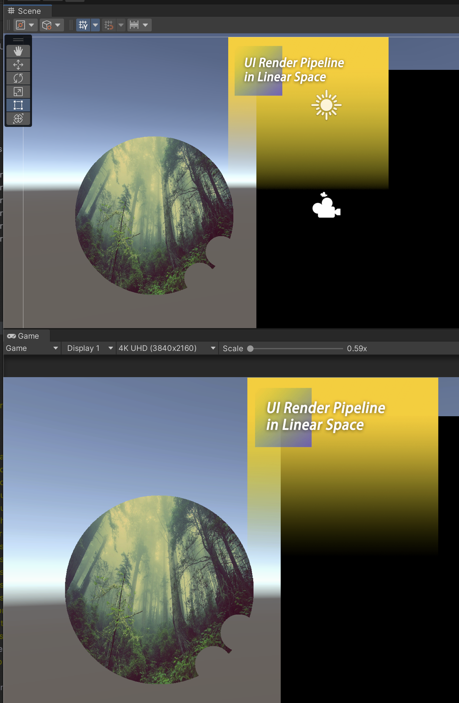

# UniversalRP 自定义渲染管线

#     

## 项目方案作者: [Killop(夜莺)]( https://github.com/killop)

本项目是 UniversalRP 的扩展库 修复线性空间中的 UI 透明度差异问题 能够让 UI 设计师在 Unity 中保持原有的 sRBG 工作流.

### Warning:
* 场景相机 和 界面相机, 最好使用独立的 RendererData
* UI Renderer Data => Opaque Layer Mask  只勾选 UI Mask
* UI Renderer Data => Transparent Layer Mask  只勾选 UI Mask
* Forward Renderer Data => Opaque Layer Mask 勾选 Everything (暂定)
* Forward Renderer Data => Transparent Layer Mask 勾选 Everything (暂定)

* 将 Graphics / Always Included Shaders / UI/Default => 修改为 URP下的 UI/Default
* 每次切换需要清理 Unity 缓存 (Library) 重启 Unity 才会生效...

### Screenshot

### Test:

| 测试平台 | 系统版本 | 主流机型 | 测试通过 |
| ------------ | ------------ | ------------ | ------------ |
| Android	  | 8 => 12  | ... | ... |
| Windows	  | 10 => 11  | ... | ... |
| Apple iPhone | 15 => 16  | ... | ... |
| Apple Mac |  12.4  | ... | ... |
